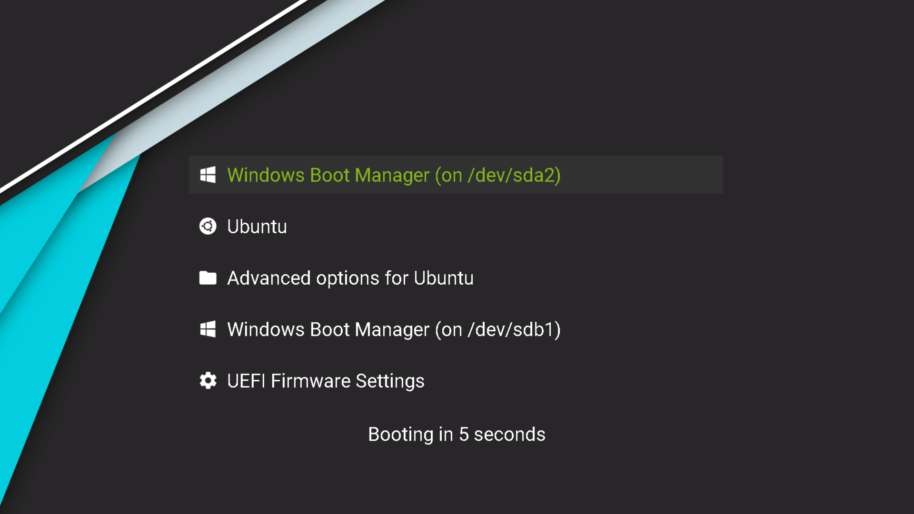

# vimix-matter-hq



`vimix-matter-hq` is a GRUB theme for 1920x1080px display that I created using [Matter](https://github.com/mateosss/matter) editor with [Vimix](https://github.com/vinceliuice/grub2-themes) background by also applying some out of Matter's scope improvements. As the layout looks cleaner and better to me than most of the publicly available themes, and I also used some options that I haven't been able to find in other repos, I decided to share my config to make your loading screen hopefully more pleasant, while also making the process of setting it up easier.


## How to use?

First, check if you have Matter's dependencies installed: these are `python` (version 3.6 or higher), `grub-mkconfig` and `grub-mkfont`, which are standart componentd of Ubuntu installations, so you should have them, and also `inkscape`, which you may have to install (`sudo apt install inkscape`).

Next, clone or download+extract this repo, then enter the `vimix-matter-hq` directory. Get your GRUB entries list using `./matter.py` and select which icons you want to have displayed next to them (find the material design icons you want [here](https://materialdesignicons.com/) and use their IDs). Set the `vmhq.sh` script as executable (`chmod +x vmhq.sh`) and run it with root privileges (so it could write to `/boot/grub`) passing the icons list: `sudo bash vmhq.sh <icon_1> <icon_2> ... <icon_X>`.

For example, this is how to get the same loading screen as on the screenshot above, supposing that you have the same menu item order:
```sh
git clone https://github.com/isikus/vimix-matter-hq
cd vimix-matter-hq
./matter.py
chmod +x vmhq.sh
sudo bash vmhq.sh microsoft-windows ubuntu folder _ _ _ _ microsoft-windows cog
```

Following Matter's readme, I should note that updates to your system will sometimes change the GRUB menu (for example, the number of available items). For this reason you'll have to rerun `sudo bash vmhq.sh` from time to time, so consider not to delete the repository folder or be ready to repeat this procedure.

## What' s changed from Matter?

* **Prebuilt image.** While Matter focuses on providing the means to compose your desired image from the modules of your selection, I instead decided to share a layout that I find aesthetically pleasant and facilitate the process of cloning this specific image. This means that, in case you have a 1920x1080 display and wish to have the same image as presented above, the process is quite simple — just follow the instructions above. If, however, you wish to change some components, you should refer to the next chapter or just use [Matter](https://github.com/mateosss/matter) — that would be easier to start from in case you want to replace the majority of my assets.
* **No stuttering when switching between menu items.** This is achieved by adding transparent pixmaps for the corners of inactive menu items with the same dimensions as the selected item ones.
* **Wider menu items.** This allows to display the full names for the majority of items, while also not obstructing the background image.
* **Prerendered Roboto font.** While some conversion results I got were pretty glitchy and ugly, Roboto seemed quite fine (see screenshot), even if still grainy — which, in fact, can not be changed.
* **Some other stuff**. I changed some font settings including size and color (to match that of Acer's logo) and used Vimix background picture (obviously).


## How do I change anything?

Depending on what you want to have changed, here are some useful tips for you. Please make any change *before* running `vmhq.sh` script.
* *Icons.* You are, in fact, *required* to list them — this is covered in **How to use?** section above. [Find](https://materialdesignicons.com/) the material design icons you need and list their IDs in correspondence with the menu items listed by `./matter.py`.
* *Background picture.* Just change the `background.jpg` in the `Matter` folder (mind the extension and resolution).
* *Item order (how did you get yours?).* This is a little bit tricky — you have to install and run [`grub-customizer`](https://launchpad.net/grub-customizer) (follow [these instructions](https://vitux.com/how-to-install-grub-customizer-on-ubuntu/)). Booting timer is also changed via `grub-customizer`.
* *Text color.* Run `python helper.py color <general_color> <selection_color>; sudo bash vmhq.sh`.
* *Font.* Get a .ttf file and then run `grub-mkconfig -v -n <font_name> -s <font_size> <font_ttf_file> -o font.pf2`. Note the font name appearing in the output of previous command and pass it to `helper.py` as such: `python helper.py font "<Your font name>"; sudo bash vmhq.sh` (mind the hyphens).
* *Screen resolution.* Uh oh — I only tested the theme on my 1920x1080 display. My best advice would be to get the appropriate media from [Vimix](https://github.com/vinceliuice/grub2-themes/tree/master/backgrounds) repo corresponding with your resolution (and possibly scale it with GIMP), recreate the transparent `inactive_*` pixmap PNGs with your proper resolution using GIMP, overwrite the media files in `Matter` folder and then probably play with font size in Matter using provided `fonts/Roboto.ttf` file and `-fs` option (e. g. `./matter.py --buildonly -ff ./fonts/Roboto.ttf -fn "Roboto Regular" -fs 24`). Please keep in mind that this process might require several trial-and-error iterations and feel free to open a pull request with your results should you succeed!
* *Other changes.* You might consider playing around with some [Matter](https://github.com/mateosss/matter) arguments (e. g. to change icon color), tweaking `theme.txt` ([this](http://wiki.rosalab.ru/en/index.php/Grub2_theme_/_reference) is the best guide I could find), replacing media in `Matter` folder or straightforward editing `/boot/grub/grub.cfg` otherwise (which is, of course, not recommended). Note that GRUB is quite a basic and low-level tool (as intended), so there might be not too many options to play with.


## Note

I am not planning to actively maintain this repo – the motivation to create this fork was just to share what I came up with in my environment. While I may add some additional fixes (probably as a result of running into any problems on my machine), I do not aim to expand the project and such. I will, however, look up to any pull requests that may be proposed and merge them. Please feel free to propose fixes or extensions to this fork!

